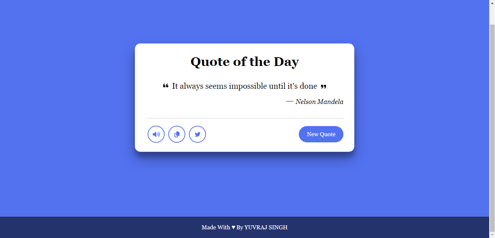

# Random Quotes Generator

The **Random Quotes Generator** is a simple yet engaging web application designed to provide users with a constant source of inspiration and wisdom. Leveraging the power of the [Quotable API](https://api.quotable.io/random), this application fetches a diverse range of thought-provoking quotes from various authors, genres, and eras, ensuring a rich and dynamic experience for users.
  

## Key Features:

1. **Random Quote Retrieval**:  
   With a single click, users can access a random quote sourced from the vast collection available through the [Quotable API](https://api.quotable.io/random). Each quote is carefully selected to inspire, motivate, or provoke thought.

2. **Audio Playback**: 
   For enhanced accessibility and convenience, the application offers an audio playback feature, allowing users to listen to the selected quote. This feature caters to users with visual impairments or those who prefer auditory learning.

3. **Copy to Clipboard**: 
   Users can easily copy their favorite quotes to the clipboard with the click of a button. This functionality enables users to save and share quotes across various platforms and applications effortlessly.

4. **Share on Twitter**: 
   Social sharing is made seamless with the integration of a "Share on Twitter" option. Users can instantly post their favorite quotes to their Twitter feed, spreading inspiration and wisdom to their followers with ease.
 
The **Random Quotes Generator** aims to serve as a versatile tool for individuals seeking daily doses of inspiration, motivation, or reflection. Whether used for personal growth, academic research, or social sharing, this application offers a user-friendly and enriching experience for all. 

## Live Demo:
Click on the link <a href="https://yuvraj-08.github.io/random-quotes-generator/" target="_blank">Hosted Link </a>  to view the site live.

## Contact
Developer's Social Handles:
- GitHub: [yuvraj-08](https://github.com/yuvraj-08)
- Youtube: [@YuvrajSingh-08](https://youtube.com/@YuvrajSingh-08)
- LinkedIn: [-yuvraj08](https://www.linkedin.com/in/-yuvraj08)
